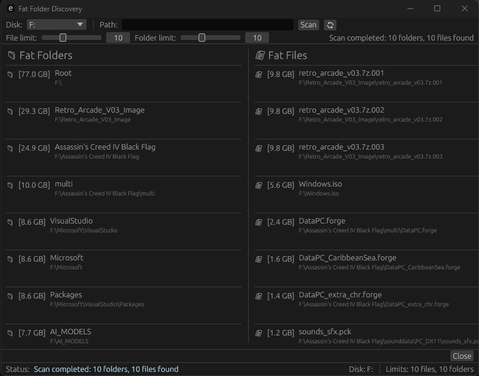

# Fat Folder Discovery

[](https://www.rust-lang.org)
[](https://www.microsoft.com/windows)
[](https://github.com/emilk/egui)
[](LICENSE)

[](https://crates.io/crates/walkdir)
[](https://crates.io/crates/tokio)
[](https://crates.io/crates/winapi)
[](https://crates.io/crates/log)
[](https://crates.io/crates/ctrlc)

A Windows desktop application built in Rust that helps you identify the largest files and folders on your disk storage. Perfect for disk cleanup and storage management.



## Features

### Core Functionality
- **Disk Selection**: Choose from available storage drives including fixed, removable, and network drives
- **Custom Path Scanning**: Scan specific directories or entire disk roots
- **Real-Time Results**: See files and folders appear as they're discovered during scanning
- **Size-Based Sorting**: Results automatically sorted by size (largest first)
- **Configurable Limits**: Adjust display limits for files and folders (5-20 entries each)

### User Interface
- **Fixed Window Size**: Optimized 800x600 pixel window
- **Two-Column Layout**: 
  - Left: Largest folders with sizes and full paths
  - Right: Largest files with type-specific icons and sizes
- **Interactive Elements**:
  - Clickable files/folders that open in Windows Explorer
  - Real-time progress updates during scanning
  - Disk refresh button
  - Stop/Resume scanning capability
- **Status Information**:
  - Current scan status and progress
  - Selected disk and custom path display
  - File and folder limit indicators

### Smart Features
- **System Protection**: Automatically skips system directories and sensitive areas
- **File Type Recognition**: Custom icons for different file types (documents, images, audio, etc.)
- **Human-Readable Sizes**: Automatic conversion to B, KB, MB, GB, TB
- **Intelligent Path Handling**: Auto-selects disk when custom path is entered

## System Requirements

- **Operating System**: Windows 10/11
- **Permissions**: Requires read access to scanned directories
- **Hardware**: Minimal requirements (runs efficiently on standard hardware)

## Installation

1. Download the latest release from the releases page
2. Extract the executable to your preferred location
3. Run `fat-folder-discovery.exe`

No installation required - the application is portable.

## Building from Source

### Prerequisites

1. Install [Rust](https://rustup.rs/) (latest stable version)
2. Install Visual Studio Build Tools with C++ workload

### Build Commands

```bash
# Clone the repository
git clone https://github.com/brhrmaster/windows-fat-files-lookup.git
cd windows-fat-files-lookup

# Build for release
cargo build --release

# Run directly
cargo run --release
```

Alternatively, use the provided build script:

```bash
.\build_and_distribute.bat
```

## Project Structure

```plaintext
src/
├── main.rs           # Application entry point and UI implementation
├── disk_scanner.rs   # Core scanning logic and result management
├── file_utils.rs     # File system utilities and disk enumeration
└── logger.rs         # Logging system implementation
```

## Dependencies

Key dependencies from Cargo.toml:

- **eframe/egui**: UI framework (v0.33.0)
- **walkdir**: Directory traversal
- **winapi**: Windows system integration
- **log**: Logging infrastructure
- **ctrlc**: Signal handling

## Technical Details

### Scanner Implementation

- **Asynchronous Operation**: Non-blocking UI during scans
- **Progress Updates**: Real-time feedback every 50 folders or 500 files
- **Memory Efficient**: Uses BinaryHeap for top-N selection
- **Error Handling**: Comprehensive error recovery and logging

### Logging System

- **File-based Logging**: Detailed operation logs in `fat-folder-discovery.log`
- **Automatic Cleanup**: Log files removed on normal application exit
- **Error Tracking**: Comprehensive error and warning logging
- **Real-time Monitoring**: Use `monitor_log.ps1` for live log viewing

### Safety Features

- **System Directory Protection**: Built-in skip list for sensitive directories
- **Error Recovery**: Graceful handling of inaccessible files/folders
- **Resource Management**: Proper cleanup on exit
- **Signal Handling**: Ctrl+C handling for clean shutdown

## Usage Tips

1. **Basic Scan**:
   - Select a disk from the dropdown
   - Click "Scan" to start
   - Review results in real-time

2. **Custom Directory Scan**:
   - Enter a specific path
   - Disk is auto-selected based on path
   - Click "Scan" to analyze

3. **Result Navigation**:
   - Click any file or folder to open in Explorer
   - Use the refresh button to update disk list
   - Adjust limits using sliders for more/fewer results

4. **Monitoring Progress**:
   - Watch the status bar for current operation
   - Progress bar shows active scanning
   - Real-time counters for files/folders found

## Contributing

Contributions are welcome! Please feel free to submit issues and pull requests.

## License

[Add your chosen license here]

## Authors

[Add author information here]

---

**Fat Folder Discovery** - Efficient disk space analysis for Windows
